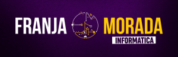

# 
Horarios de las 16 comisiones del Curso Inicial 2022 para el ingreso a la Facultad de Informática de la UNLP
#

Lenguajes utilizados:
- Python 3.8
- HTML5
- CSS3
- JavaScript 1.5

Frameworks:
- Flask 1.1.x/Jinja 2.11.x
- jQuery 3.3.1
- Bootstrap 4.5
- FullCalendar 5.1
- Line Awesome 1.3
#
> realizado con 💚 por [**reimon**](//github.com/reimonlp) *(Ramón Ligorria)* bajo licencia [**GNU GPLv3**](LICENSE)
